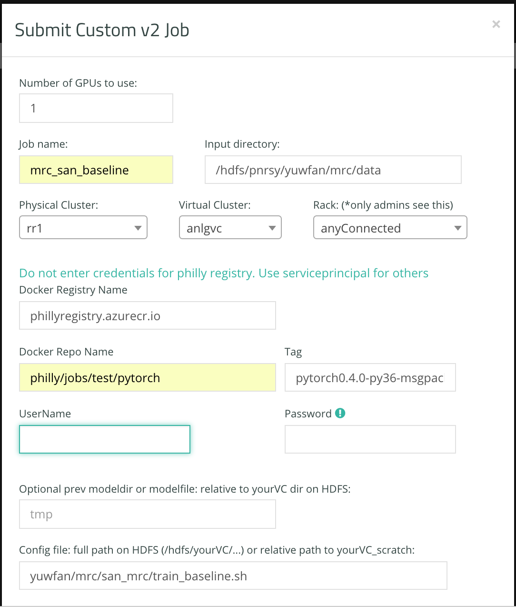

# Prerequisite
## Access Philly
* Join "pnrsy" (Philly Nursery group via idweb)
* Join a dedicated VC, eg: pnrsy, resrchvc 
* Knowing your physical and virtual cluster
* [More details](https://phillydocs.azurewebsites.net/articles/Getting_Access.html)

## Determine your data location
* Warm Storage: it is your data in HDFS, eg.\\storage.rr1.philly.selfhost.corp.microsoft.com​\pnrsy
* Hot Storage: your scripts or code, eg.\\storage.rr1.philly.selfhost.corp.microsoft.com​\pnrsy_scratch

# Submit experiments
Once our data is in HDFS and the config files are in warm or hot storage (HDFS or GFS), then we could submit jobs by [Philly](https://philly/) portal or via our developed scripts based on their REST API.

## Philly Portal via custom job v2
Please go to [Philly](https://philly) portal -> Submit Job -> Custom Job v2. And follow  to fill your customized parameters.

You may need to notice these fields:

* Input Directory: /hdfs/$vc/$myDir/$myData or /philly/$cluster/$vc/$myDir/$myData
* Physical cluster: physical cluster to run the job on, such as gcr, rr1.
* Virtual Cluster: virtual cluster you are assigned to, such as pnrsy, resrchvc
* Config Dir: full path on HDFS (/hdfs/yourVC/...) or relative path to yourVC_scratch 
* Docker repo name: philly/jobs/test/pytorch
* Tag: pytorch0.4.0-py36-msgpack

## Bash scripts

Please see /tools/philly/ in our repo. Before you use it, you should change `$USERNAME`, `$VC` and `$CLUSTER` within the script. Now it supports:

* Submit job: `sh philly_rest.sh submit $job_name`
* Abort job: `sh philly_rest.sh abort $job_id`
* Query job status: `sh philly_rest.sh query $job_id`
* List all your jobs: `sh philly_rest.sh list`

The bash script are developed based on [Philly Rest API](https://microsoft.sharepoint.com/:w:/r/teams/ATISG/_layouts/15/WopiFrame.aspx?sourcedoc={A4EFAD56-16D6-43B8-AE07-E158B34DA643}&file=Philly%20REST%20API.docx&action=default).

# Others
## Docker setup
* [Custom Job V2 Page Guide](https://phillydocs.azurewebsites.net/articles/Custom_Job_V2.html)
* [Docker register repo](https://philly.visualstudio.com/DefaultCollection/_git/commonPhilly)

## Copy data via scripts
* [Philly-fs](https://phillydocs.azurewebsites.net/articles/philly_fs.html)

Please contact yuwfan@microsoft.com or [Philly](https://philly) if there is any issue.

